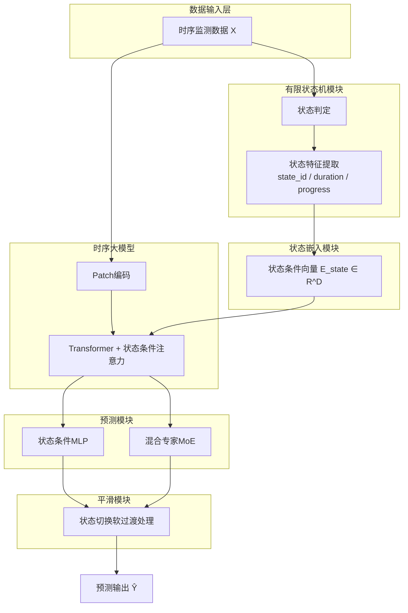
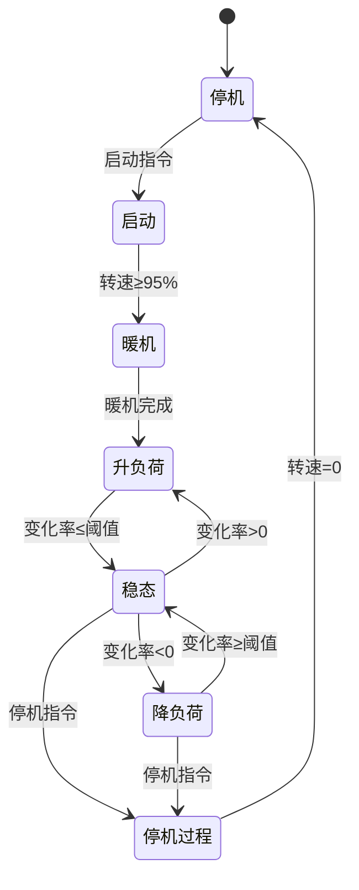

# 专利交底书

## 一、发明名称

**基于状态机引导的时序大模型燃气轮机在线仿真方法及系统**

---

## 二、技术领域

本发明涉及燃气轮机仿真技术领域，尤其涉及一种结合有限状态机与时序基础大模型的燃气轮机在线仿真方法及系统。

---

## 三、背景技术

### 3.1 现有技术描述

燃气轮机运行过程中会经历多种工况状态（如启动、暖机、升负荷、稳态运行、降负荷、停机等），不同状态下系统的动态特性差异显著。现有燃气轮机仿真技术主要包括：

1. **单一模型全工况仿真**：采用统一的神经网络模型覆盖所有工况，模型需要同时学习多种截然不同的动态特性，导致各工况下的预测精度均受影响。

2. **多模型切换仿真**：为每种工况训练独立模型，运行时根据工况切换模型。该方法模型数量多、维护成本高，且切换时刻容易产生预测不连续。

3. **传统时序预测模型**：采用LSTM、Transformer等模型进行时序预测，未能利用燃气轮机运行的状态机结构先验知识。

4. **时序基础大模型**：近年出现的预训练时序大模型（如PatchTST、TimesFM等）具有强大的时序建模能力，但直接应用于燃气轮机仿真时，缺乏对运行状态的感知。

### 3.2 现有技术的缺陷

1. **状态感知能力不足**：现有深度学习方法缺乏对燃气轮机运行状态的显式建模，无法根据当前状态调整预测策略。

2. **状态切换处预测震荡**：在工况切换时刻（如从升负荷转入稳态），模型容易产生预测震荡或不连续。

3. **大模型通用性与领域适配矛盾**：时序大模型具有通用时序建模能力，但直接微调可能丢失预训练知识，且缺乏融入领域先验的机制。

4. **可解释性差**：无法解释模型在不同状态下的预测行为差异。

---

## 四、发明目的

本发明的目的在于提供一种基于状态机引导的时序大模型燃气轮机在线仿真方法及系统，通过有限状态机显式建模燃气轮机的运行状态及状态转移规则，将状态信息作为条件注入时序大模型，实现状态感知的高精度在线仿真，同时解决状态切换处的预测平滑性问题。

---

## 五、技术方案

### 5.1 技术方案概述

本发明提出的基于状态机引导的时序大模型燃气轮机在线仿真方法，包括以下步骤：

**步骤1：燃气轮机运行状态机构建**  
- 定义燃气轮机运行状态集合 $S = \{s_1, s_2, ..., s_K\}$  
- 典型状态包括：停机($s_1$)、启动($s_2$)、暖机($s_3$)、升负荷($s_4$)、稳态运行($s_5$)、降负荷($s_6$)、停机过程($s_7$)等  
- 定义状态转移函数 $\delta: S \times C \rightarrow S$，其中 $C$ 为转移条件集合  
- 状态转移条件基于关键变量阈值（如转速、功率、温度变化率等）  

**步骤2：实时状态识别与特征提取**  
- 根据当前时刻监测数据，通过状态机判定当前状态 $s_t$  
- 提取状态特征向量，包括：  
  - 状态标识 $s_{id} \in \{1,2,...,K\}$  
  - 状态持续时间 $t_{duration}$  
  - 状态内相对进度 $p_{progress}$  
  - 前序状态序列 $[s_{t-1}, s_{t-2}, ...]$  
  - 状态转移概率分布 $P(s_{t+1}|s_t)$  

**步骤3：状态条件嵌入生成**  
- 将状态特征编码为条件嵌入向量  
$$E_{state} = \text{StateEncoder}(s_{id}, t_{duration}, p_{progress}, ...) \in \mathbb{R}^{D}$$  
- StateEncoder可采用可学习嵌入表+MLP结构

**步骤4：时序大模型输入构造**  
- 对原始监测序列进行Patch划分：$X \rightarrow \{P_1, P_2, ..., P_N\}$  
- 每个Patch通过线性投影得到Token嵌入  
- 将状态条件嵌入与时序Token融合：  
$$Z_i = \text{PatchEmbed}(P_i) + \alpha \cdot E_{state}$$  
- 或采用Prefix方式：将 $E_{state}$ 作为前缀Token拼接到序列前端  

**步骤5：状态条件时序大模型推理**  
- 将融合状态信息的Token序列输入时序大模型（如PatchTST、iTransformer等）  
- 大模型在状态条件引导下进行时序建模  
$$H = \text{TimeSeriesLLM}([E_{state}; Z_1, Z_2, ..., Z_N])$$  

**步骤6：状态感知预测头输出**  
- 采用状态条件预测头，不同状态可激活不同的输出参数  
$$\hat{Y} = \text{StateAwareMLP}(H, s_{id})$$  
- 或采用混合专家结构：不同状态路由到不同专家网络  

**步骤7：状态切换平滑处理**  
- 检测状态切换事件（$s_t \neq s_{t-1}$）  
- 在切换窗口内，采用状态混合策略：  
$$\hat{Y}_{smooth} = \lambda \cdot \hat{Y}_{s_{t-1}} + (1-\lambda) \cdot \hat{Y}_{s_t}$$  
- $\lambda$ 随切换后时间步递减（如指数衰减）

### 5.2 系统架构

**核心流程**：`时序数据` → `状态机判定` → `状态嵌入注入` → `时序大模型推理` → `状态切换平滑` → `预测输出`  

#### 状态转移图

### 5.3 关键技术细节

#### 5.3.1 燃气轮机状态机定义

| 状态ID | 状态名称 | 进入条件 | 退出条件 |
|--------|---------|---------|---------|
| $s_1$ | 停机 | 转速=0 且 无启动指令 | 接收启动指令 |
| $s_2$ | 启动 | 启动指令=1 且 转速<额定95% | 转速≥额定95% |
| $s_3$ | 暖机 | 转速≥95% 且 暖机计时<设定值 | 暖机计时≥设定值 |
| $s_4$ | 升负荷 | 功率变化率>阈值(正) | 功率变化率≤阈值 |
| $s_5$ | 稳态运行 | |功率变化率|<阈值 | 功率变化率超阈值 |
| $s_6$ | 降负荷 | 功率变化率<阈值(负) | 功率变化率≥阈值 |
| $s_7$ | 停机过程 | 停机指令=1 | 转速=0 |

#### 5.3.2 状态特征向量构成

状态特征向量 $F_{state}$ 包含以下分量：

| 特征名称 | 符号 | 计算方式 | 维度 |
|---------|------|---------|------|
| 状态独热编码 | $s_{onehot}$ | OneHot(s_id, K) | K |
| 状态持续时间 | $t_{dur}$ | 当前时刻 - 进入状态时刻 | 1 |
| 状态内进度 | $p_{prog}$ | $t_{dur}$ / 历史平均状态时长 | 1 |
| 前一状态 | $s_{prev}$ | OneHot(s_{t-1}, K) | K |
| 转移概率 | $P_{trans}$ | 基于历史统计的转移概率 | K |
| 关键变量值 | $v_{key}$ | [转速%, 功率%, 温度差] | 3 |

总维度：$2K + K + 5 = 3K + 5$（K=7时为26维）

#### 5.3.3 状态条件注入方式

**方式A：加性融合**  
$$Z_i = \text{PatchEmbed}(P_i) + \text{StateEmbed}(s_t)$$  

**方式B：Prefix Token**  
$$\text{Input} = [\text{StateToken}; Z_1, Z_2, ..., Z_N]$$  

**方式C：Cross-Attention**  
$$Z' = Z + \text{CrossAttn}(Q=Z, K=V=\text{StateEmbed}(s_t))$$  

**方式D：FiLM调制**  
$$Z' = \gamma(s_t) \odot Z + \beta(s_t)$$  

其中 $\gamma, \beta$ 是状态条件生成的缩放和偏移参数。

#### 5.3.4 状态切换平滑策略

为避免状态切换时预测突变，采用软切换机制：

1. **时间衰减混合**：  
$$\hat{Y}_t = \lambda_t \cdot f_{s_{old}}(X_t) + (1-\lambda_t) \cdot f_{s_{new}}(X_t)$$  
$$\lambda_t = \exp(-t_{after}/\tau), \quad \tau \text{为衰减常数}$$  

2. **状态���率混合**：  
$$\hat{Y}_t = \sum_{s \in S} P(s|X_t) \cdot f_s(X_t)$$  
状态概率 $P(s|X_t)$ 由状态分类器输出。

3. **滑动窗口边界检测**：  
在状态切换前后各 $W$ 步内启用混合模式。

---

## 六、有益效果

本发明相比现有技术具有以下有益效果：

1. **状态感知能力**：通过有限状态机显式建模燃气轮机运行状态，模型能够根据当前状态自适应调整预测策略，提高各工况下的预测精度。

2. **时序大模型能力继承**：基于预训练时序大模型，继承其强大的时序建模能力，同时通过状态条件注入实现领域适配，避免从头训练。

3. **状态切换平滑**：引入状态切换平滑机制，有效解决工况切换时刻的预测震荡问题，保证仿真输出的连续性。

4. **参数高效适配**：状态条件嵌入模块参数量远小于时序大模型主体，支持冻结大模型仅训练状态模块的高效微调方式。

5. **可解释性增强**：  
   - 状态机提供清晰的工况解释  
   - 不同状态下的模型行为可分别分析  
   - 状态转移逻辑可与专家知识对照验证

6. **工程可维护性**：  
   - 状态定义和转移规则可根据实际需求灵活调整  
   - 新增状态只需扩展状态嵌入表，无需重训整体模型  
   - 状态特征提取与深度学习模块解耦

---

## 七、附图说明

**图1**：本发明的整体系统架构图

**图2**：燃气轮机运行状态机状态转移图
- 节点：各运行状态
- 边：状态转移及条件

**图3**：状态条件嵌入生成过程示意图

**图4**：状态条件注入时序大模型的四种方式对比
- 图4a：加性融合
- 图4b：Prefix Token
- 图4c：Cross-Attention
- 图4d：FiLM调制

**图5**：状态切换平滑处理示意图
- 展示切换前后预测值的混合过程

**图6**：不同状态下的预测效果对比曲线

---

## 八、具体实施方式

### 8.1 实施例1：完整升降负荷过程仿真

**应用场景**：仿真燃气轮机从停机→启动→暖机→升负荷→稳态→降负荷→停机的完整过程

**模型配置**：  
- 时序大模型：PatchTST-Base（预训练权重）  
- Patch长度：16步  
- 输入窗口：96步（6个Patch）  
- 状态数量：K=7  
- 状态嵌入维度：D=256

**训练策略**：  
1. 冻结PatchTST主体参数  
2. 仅训练：状态嵌入表、状态条件MLP、预测头  
3. 训练数据按状态均衡采样  
4. 损失函数：MSE + 状态分类辅助损失

**仿真效果**：  
| 状态 | 温度MAE(°C) | 功率MAPE(%) |
|-----|------------|-------------|
| 启动 | 3.2 | 2.1 |
| 升负荷 | 1.8 | 0.8 |
| 稳态 | 0.9 | 0.3 |
| 降负荷 | 1.5 | 0.6 |
| 全工况平均 | 1.6 | 0.7 |

### 8.2 实施例2：状态切换平滑效果验证

**测试场景**：升负荷(s4)→稳态(s5)切换时刻

**对比实验**：  
| 方法 | 切换窗口MAE | 切换处最大偏差 |
|-----|------------|--------------|
| 无平滑 | 4.2°C | 8.5°C |
| 时间衰减混合(τ=5) | 1.8°C | 2.3°C |
| 状态概率混合 | 1.5°C | 1.9°C |

**结论**：状态切换平滑机制显著降低切换时刻的预测震荡。

### 8.3 实施例3：新状态快速适配

**场景**：新增"快速升负荷"状态（AGC调频响应）

**适配步骤**：  
1. 定义新状态 $s_8$ 及转移条件  
2. 初始化新状态嵌入向量（可从"升负荷"状态嵌入初始化）  
3. 收集新状态样本（约100条）  
4. 仅训练新状态嵌入及预测头参数  
5. 训练时间：< 10分钟（单GPU）

**效果**：新状态预测MAE迅速收敛至2.1°C（温度）、0.9%（功率）。

---

## 九、权利要求书（建议）

### 权利要求1
一种基于状态机引导的时序大模型燃气轮机在线仿真方法，其特征在于，包括以下步骤：  
- 构建燃气轮机运行有限状态机，定义运行状态集合及状态转移规则；  
- 根据实时监测数据，通过状态机判定当前运行状态，并提取状态特征向量；  
- 将状态特征编码为状态条件嵌入向量；  
- 将状态条件嵌入注入时序大模型的输入或中间层；  
- 通过状态条件引导的时序大模型进行时序建模与预测；  
- 输出状态感知的仿真预测结果。

### 权利要求2
根据权利要求1所述的方法，其特征在于，所述状态特征向量包括：状态标识、状态持续时间、状态内相对进度、前序状态及状态转移概率分布。

### 权利要求3
根据权利要求1所述的方法，其特征在于，所述状态条件嵌入注入方式包括：加性融合、前缀Token拼接、交叉注意力或FiLM调制中的一种或组合。

### 权利要求4
根据权利要求1所述的方法，其特征在于，还包括状态切换平滑处理步骤，在检测到状态切换时，采用时间衰减混合或状态概率混合策略平滑预测输出。

### 权利要求5
根据权利要求1所述的方法，其特征在于，所述时序大模型采用预训练模型，训练时冻结大模型主体参数，仅训练状态嵌入模块和预测头。

### 权利要求6
根据权���要求1所述的方法，其特征在于，所述运行状态包括：停机、启动、暖机、升负荷、稳态运行、降负荷和停机过程。

### 权利要求7
一种基于状态机引导的时序大模型燃气轮机在线仿真系统，其特征在于，包括：  
- 有限状态机模块：用于定义运行状态及转移规则，实时判定当前状态；  
- 状态特征提取模块：用于提取状态标识、持续时间、进度等状态特征；  
- 状态条件嵌入模块：用于将状态特征编码为嵌入向量；  
- 时序大模型模块：用于在状态条件引导下进行时序建模；  
- 状态感知预测模块：用于输出状态相关的预测结果；  
- 状态切换平滑模块：用于处理状态切换时的预测平滑。

---

## 十、发明人信息

- 发明人：[待填写]
- 联系方式：[待填写]
- 单位：[待填写]

---

## 十一、相关现有技术文献

1. Nie Y, et al. "A Time Series is Worth 64 Words: Long-term Forecasting with Transformers." ICLR 2023. (PatchTST)
2. Das A, et al. "A Decoder-Only Foundation Model for Time-Series Forecasting." ICML 2024. (TimesFM)
3. Zhou T, et al. "One Fits All: Power General Time Series Analysis by Pretrained LM." NeurIPS 2023.
4. Perez E, et al. "FiLM: Visual Reasoning with a General Conditioning Layer." AAAI 2018.
5. 燃气轮机运行状态划分及控制相关专利及文献

---

**交底书完成日期**：2026年2月6日